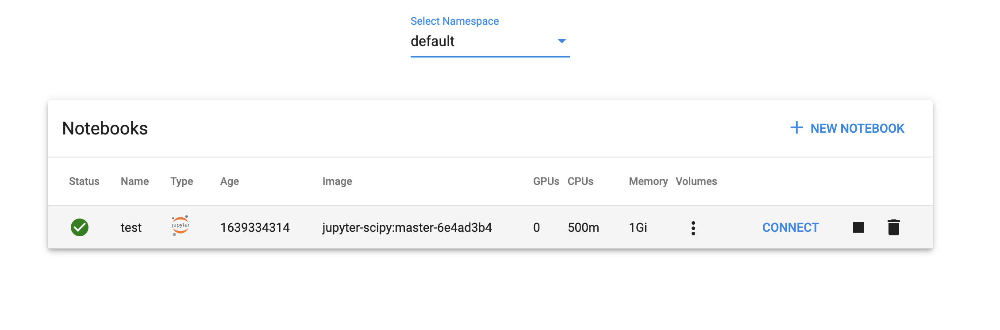
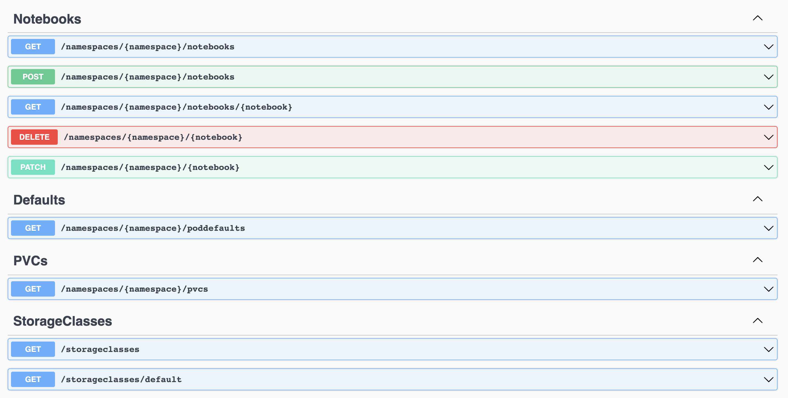

# KubeGo Notebooks

KubeGo notebooks is a Go implementation of kubeflow notebooks. 
It leverages kubeflow's [notebook controller](https://github.com/kubeflow/kubeflow/tree/master/components/notebook-controller).


Ease-of-use is the primary goal of this project. It allows using a normal ingress controller such as Nginx to expose notebooks as native kubernetes ingresses instead
of relying on Istio.

It also has full swagger documentation for interacting with the API programmatically.


## Install Dependencies

```bash
make install-deps
```

## Docker Build
```bash
docker build -t $YOUR_REPO/notebook-api .
```

## Docker Push
```bash
docker push $YOUR_REPO/notebook-api
```

## Install
```bash
helm install \
    --set image.repository=$YOUR_REPO/notebook-api \
    --set image.tag=latest \
    kubego-notebooks ./deployment/notebooks
```


## Running locally
```bash
docker run -v ${HOME}/.kube:/home/.kube -p 8000:8000 notebook-api
```

## Configuration
```yaml
server:
  # Server Bind address
  address: 0.0.0.0:8000
  apiPrefix: "/api"

cors:
  enabled: true
  accessControlAllowOrigin: "*"
  acccessControlAllowCredentials: "true"
  accessControlAllowHeaders: "Content-Type, Content-Length, Accept-Encoding, X-CSRF-Token, Authorization, accept, origin"
  accessControlAllowMethods: "POST,HEAD,PATCH,OPTIONS,GET,PUT"


# InCluster will use a service account if true
# If false, will use local kube context
inCluster: true
spawnerConfigPath: ./config/spawner_ui_config.yaml

# Ingress Settings
ingress:
  ## Set create true to create an ingress for notebook servers
  create: true
  domain: .example.com
  tls: false
  annotations: {}
    # "cert-manager.io/cluster-issuer": "vault-issuer"
    # "kubernetes.io/ingress.class": "nginx"
    # "nginx.ingress.kubernetes.io/proxy-body-size": "0"
```






